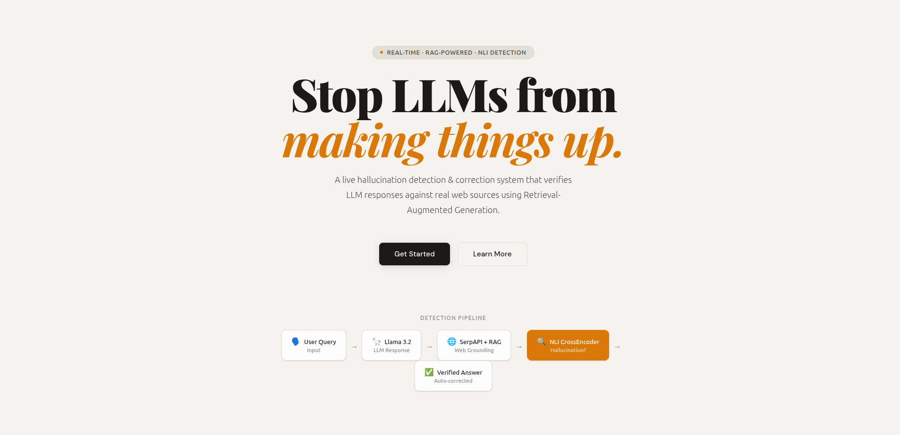
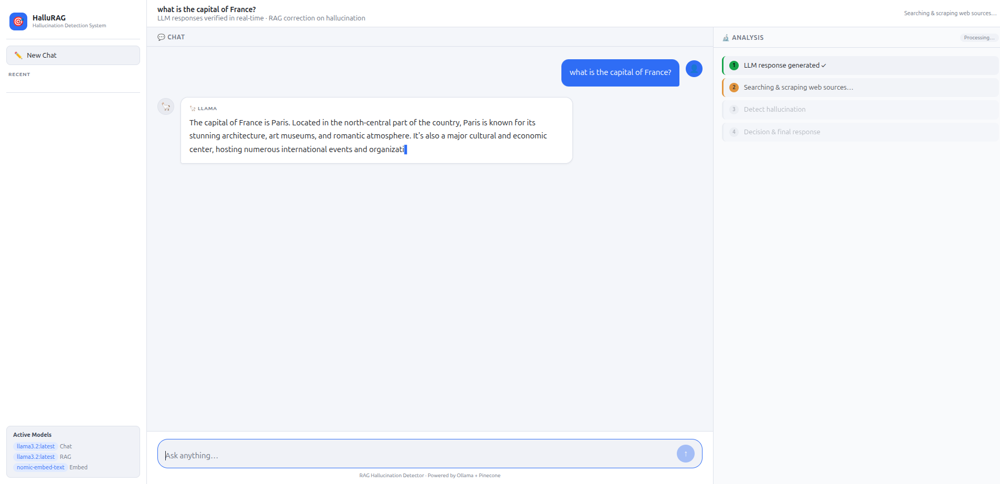
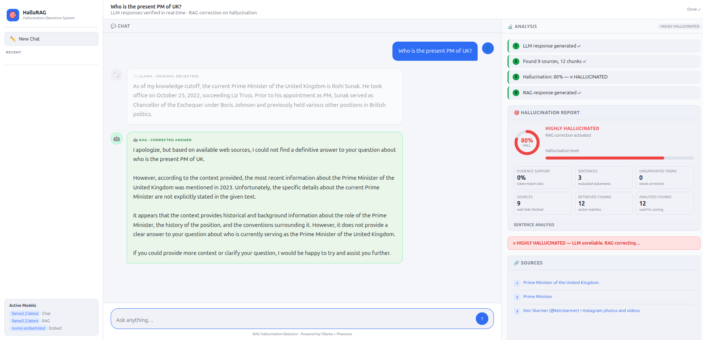
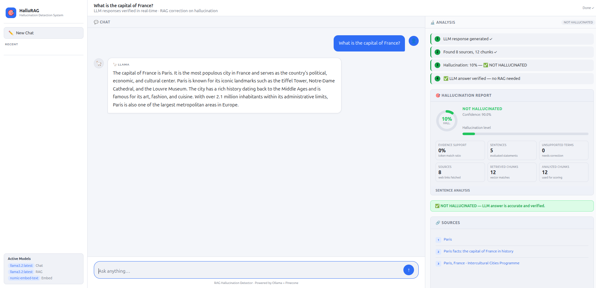
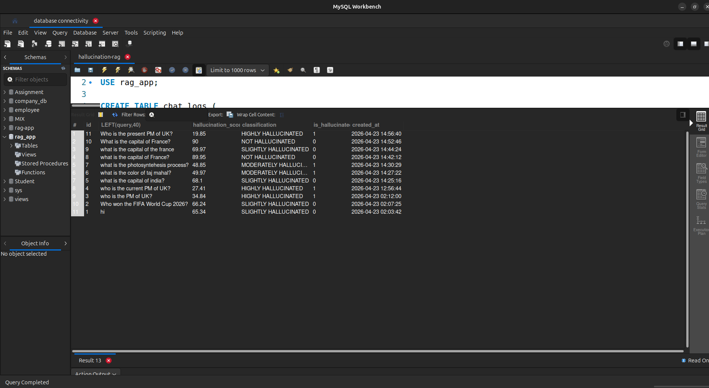
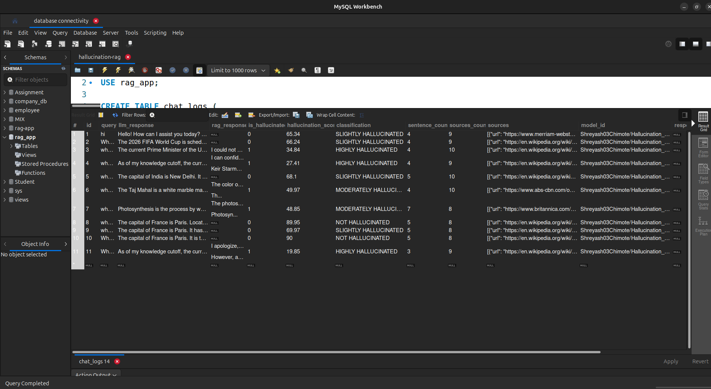
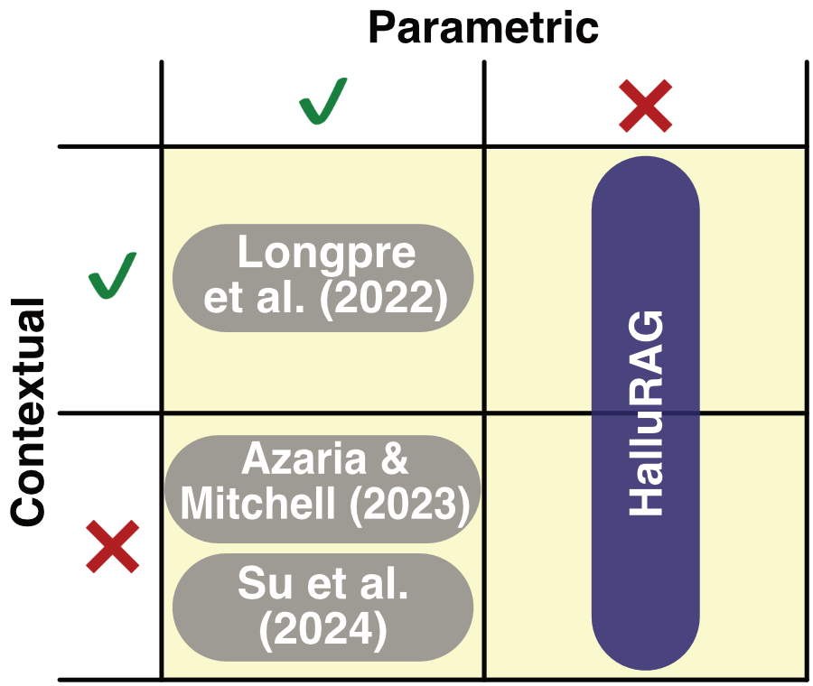

# 🎯 LLM Hallucination Detection & Correction Using RAG

A real-time hallucination detection system that verifies LLM responses against live web sources and auto-corrects using Retrieval-Augmented Generation (RAG).

---

# 📸 Sample Output

## Light theme UI — welcome screen

## Query in progress

## Hallucination detected + RAG correction 

## Not hallucinated result

## MySQL Workbench — chat_logs table



---

## 🧠 How It Works




---

## 🤖 Model Information

### Hallucination Detection Model
- **Model:** [`Shreyash03Chimote/Hallucination_Detection`](https://huggingface.co/Shreyash03Chimote/Hallucination_Detection)
- **Type:** CrossEncoder (NLI — Natural Language Inference)
- **Hosted on:** HuggingFace 🤗 (no download needed — loaded automatically via `sentence-transformers`)
- **Task:** Given a (context, claim) pair → predicts Entailment / Contradiction / Neutral

### LLM (Chat + RAG)
- **Model:** `llama3.2:1b` via [Ollama](https://ollama.ai)
- **Local inference** — no API key required for the LLM

### Embeddings
- **Model:** `nomic-embed-text` via Ollama
- **Stored in:** Pinecone vector database

> ⚠️ No model weights need to be downloaded manually. All models load automatically on first run.

---

## 📊 Dataset

### Live RAG Pipeline (Runtime)
This project uses a **live RAG pipeline** for query processing:

| Component | Source |
|---|---|
| Web context | [SerpAPI](https://serpapi.com) — real-time Google search results |
| Web content | Scraped via `langchain`'s `WebBaseLoader` |
| Vector index | Pinecone — rebuilt per query (ephemeral namespace) |
| Chat logs | MySQL (`rag_app.chat_logs`) |

### HalluRAG Dataset (Training & Testing)
For training and testing hallucination detection classifiers, this project uses the **[HalluRAG Dataset](https://arxiv.org/abs/2412.17056v1)** (pickle format):

**Dataset Details:**
- **Name**: HalluRAG - Detecting Closed-Domain Hallucinations in RAG Applications
- **Size**: 19,731 validly annotated sentences
- **Source**: Wikipedia articles (recent updates after Feb 22, 2024 cutoff)
- **Models Used**: LLaMA-2-7B, LLaMA-2-13B, Mistral-7B with quantizations (float8, int8, int4)
- **Contents**:
  - ✅ RAG prompts (answerable & unanswerable questions)
  - ✅ LLM-generated responses
  - ✅ Internal states (contextualized embedding vectors, intermediate activation values)
  - ✅ Hallucination labels (binary classification)
- **Download**: [DOI: 10.17879/84958668505](https://doi.org/10.17879/84958668505)
- **Code**: [GitHub: F4biian/HalluRAG](https://github.com/F4biian/HalluRAG)

**Usage in this Project:**
The HalluRAG dataset (in pickle format) can be used to train MLP classifiers for sentence-level hallucination detection. The trained models analyze LLM internal states to predict whether a generated sentence is hallucinated, achieving test accuracies up to 75% (Mistral-7B).

**Citation:**
```
Ridder, F., & Schilling, M. (2024). 
The HalluRAG Dataset: Detecting Closed-Domain Hallucinations in RAG Applications 
Using an LLM's Internal States. arXiv preprint arXiv:2412.17056v1
```

If you want to test with a fixed dataset, you can pre-populate the Pinecone index manually using the vector store utilities in `backend/server.py`.

---

## 🗂️ Project Structure

```
hallucination-rag/
├── backend/                       # Python Flask AI backend
│   ├── server.py                  # Main Flask app + RAG + hallucination detection
│   ├── config.py                  # Model/threshold configuration
│   └── requirements.txt           # Python dependencies
│
├── api/                           # Node.js MySQL REST API
│   ├── server.js                  # Express server (port 3001)
│   └── db.js                      # MySQL connection
│
├── frontend/                      # Static HTML/JS UI
│   ├── index.html                 # Main chat app + integrated welcome hero
│   ├── welcome.html               # Welcome page design (reference)
│   └── public/                    # Favicons, web manifest
│
├── docs/                          # Documentation & architecture
│   ├── README.md                  # Project documentation
│   ├── plan.md                    # Technical planning notes
│   ├── DockerPlan.md              # Docker setup (archived)
│   ├── Flow_of_rag/               # Architecture diagrams & flow charts
│   └── screenshots/               # UI screenshots & demos
│
├── scripts/                       # Helper shell scripts
│   ├── start_backend.sh           # Start Flask server
│   ├── cleanup.sh                 # Stop & cleanup processes
│   └── init-ollama.sh             # Initialize Ollama models
│
├── model/                         # Embeddings & model storage
│   └── (generated on first run)
│
├── START.sh                       # Main startup script (all services)
├── QUICK_START.md                 # Setup & execution guide
├── TEST_CASES_0_HALLUCINATION.md  # Test suite (0% hallucination cases)
├── .env                           # Environment variables (user-created from .env.example)
├── .env.example                   # Template for API keys & configuration
├── .gitignore                     # Git ignore rules
├── package.json                   # Node.js dependencies
├── package-lock.json              # Locked dependency versions
├── README.md                      # This file
└── image-*.png                    # Screenshots for documentation
```

---

## ⚙️ Prerequisites

| Tool | Version | Purpose |
|---|---|---|
| Python | 3.10+ | Flask backend |
| Node.js | 18+ | MySQL API |
| Ollama | Latest | Local LLM + embeddings |
| MySQL | 8.0+ | Chat log persistence |
| [SerpAPI key](https://serpapi.com) | — | Web search |
| [Pinecone key](https://pinecone.io) | — | Vector database |
| [HuggingFace token](https://huggingface.co/settings/tokens) | — | CrossEncoder model |

---

## 🚀 Setup & Execution

**👉 For fastest setup, see [QUICK_START.md](QUICK_START.md) or run:**

```bash
chmod +x START.sh
./START.sh
```

This will automatically set up all services (Ollama, Flask backend, Node.js API, frontend) in tmux or provide instructions for manual terminal setup.

---

### Manual Setup (if preferred):

#### 1. Clone the repository
```bash
git clone https://github.com/<your-username>/hallucination-rag.git
cd hallucination-rag
```

#### 2. Configure environment variables
```bash
cp .env.example .env
# Fill in your API keys (see .env.example for all required keys)
```

#### 3. Install Ollama models
```bash
ollama pull llama3.2:1b
ollama pull nomic-embed-text
```

#### 4. Set up MySQL database
```sql
CREATE DATABASE rag_app;
USE rag_app;

CREATE TABLE chat_logs (
  id                  INT AUTO_INCREMENT PRIMARY KEY,
  query               TEXT NOT NULL,
  llm_response        TEXT,
  rag_response        TEXT,
  is_hallucinated     TINYINT(1)   DEFAULT 0,
  hallucination_score FLOAT,
  classification      VARCHAR(50),
  sentence_count      INT          DEFAULT 0,
  sources_count       INT          DEFAULT 0,
  sources             JSON,
  model_id            VARCHAR(150),
  response_time_ms    INT,
  created_at          TIMESTAMP    DEFAULT CURRENT_TIMESTAMP
);
```

#### 5. Start the Python Flask backend
```bash
python -m venv venv
source venv/bin/activate
pip install -r backend/requirements.txt

python backend/server.py
# → Running at http://127.0.0.1:8080
```

#### 6. Start the Node.js MySQL API (optional)
```bash
npm install
node api/server.js
# → Running at http://127.0.0.1:3001
```

#### 7. Open the UI
Open `frontend/index.html` in VS Code with **Live Server**, or visit:
```
http://127.0.0.1:5500
```

---

## 🌐 API Endpoints

### Flask (`:8080`)
| Method | Path | Description |
|---|---|---|
| `GET` | `/api/health` | Health check |
| `GET` | `/api/chat/stream?q=<query>` | SSE stream — LLM + RAG + hallucination |
| `GET` | `/api/models` | Currently configured model names |

### Node.js (`:3001`)
| Method | Path | Description |
|---|---|---|
| `POST` | `/api/save` | Save a chat log to MySQL |
| `GET` | `/api/history` | Fetch last 100 chat logs |
| `DELETE` | `/api/history/:id` | Delete a specific log |

---

## 🔑 Environment Variables

See [`.env.example`](.env.example) for the full list. Required:

```env
SERPAPI_API_KEY=your_serpapi_key
PINECONE_API_KEY=your_pinecone_key
HF_API_TOKEN=your_huggingface_token
OLLAMA_BASE_URL=http://localhost:11434
```

---

## 📦 Tech Stack

| Layer | Technology |
|---|---|
| LLM | Ollama (`llama3.2:1b`) |
| Embeddings | Ollama (`nomic-embed-text`) |
| Vector DB | Pinecone |
| Web Search | SerpAPI |
| Hallucination Detection | HuggingFace CrossEncoder (NLI) |
| Backend (AI) | Python / Flask / LangChain |
| Backend (Logging) | Node.js / Express |
| Database | MySQL 8 |
| Frontend | Vanilla HTML / CSS / JS |

---

## Thank you !!
