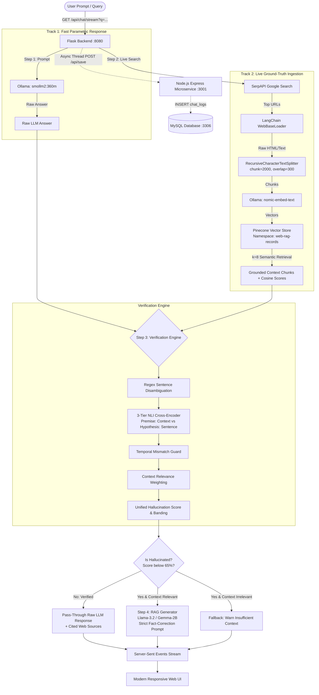

# 🎙️ Engineering Interview Deep-Dive: LLM Hallucination Detection & Correction Using RAG

> **Author / Maintainer Context**: Complete system architecture, technical design decisions, end-to-end execution flow, technology justifications, and interview defense guide.

---

## 📑 Table of Contents
1. [Executive Summary & 30-Second Elevator Pitch](#1-executive-summary--30-second-elevator-pitch)
2. [Problem Statement & Industry Context](#2-problem-statement--industry-context)
3. [End-to-End System Architecture & Execution Flow](#3-end-to-end-system-architecture--execution-flow)
4. [Granular Pipeline Breakdown (Step-by-Step)](#4-granular-pipeline-breakdown-step-by-step)
5. [Technology Stack & Architectural Trade-offs ("Why This Tech?")](#5-technology-stack--architectural-trade-offs-why-this-tech)
6. [Hallucination Detection Mathematics & NLI Logic](#6-hallucination-detection-mathematics--nli-logic)
7. [Repository & Codebase Structure](#7-repository--codebase-structure)
8. [Failure Modes, Edge Cases & Resilience Strategies](#8-failure-modes-edge-cases--resilience-strategies)
9. [Top 12 Technical Interview Questions & High-Scoring Answers](#9-top-12-technical-interview-questions--high-scoring-answers)
10. [Future Production Scalability Roadmap](#10-future-production-scalability-roadmap)

---

## 1. Executive Summary & 30-Second Elevator Pitch

### The 30-Second Interview Hook
> *"I designed and built an end-to-end, real-time Hallucination Detection and Auto-Correction system for LLMs. Instead of blindly trusting parametric model outputs or redundantly running expensive RAG pipelines for every query, the system uses a **dual-track architecture**: it serves a fast baseline response using an ultra-lightweight local LLM (`SmolLM2-360M`), concurrently pulls live grounded evidence from the web via SerpAPI and Pinecone, performs **sentence-level Natural Language Inference (NLI) cross-encoder verification** against the retrieved premises, and only triggers a heavy generative correction model (`Llama-3.2-3B` / `Gemma-2-2B`) if factual contradictions or unsupported claims are detected.*
>
> *The system features a **3-tier fault-tolerant detection hierarchy** (Hosted Inference Router → Local CPU CrossEncoder → Vector Cosine Fallback), a **temporal mismatch guard**, context relevance weighting to prevent false positives from noisy web scrapes, streaming telemetry over **Server-Sent Events (SSE)**, and non-blocking asynchronous audit logging into **MySQL** via an isolated Node.js microservice."*

---

## 2. Problem Statement & Industry Context

### Why is this problem critical?
1. **Parametric Knowledge Decay**: Large Language Models store world knowledge inside frozen weights. When asked about recent events, dates, or evolving facts, they generate plausible-sounding falsehoods (hallucinations).
2. **The "Always-RAG" Inefficiency**: Running heavy vector retrieval, context stuffing, and multi-billion parameter generation for every single user turn introduces high latency (2-8 seconds) and excessive compute costs, even when the model's internal knowledge was 100% correct.
3. **Silent Hallucination in Closed & Open Domains**:
   - *Intrinsic Hallucination*: The model directly contradicts provided source documents.
   - *Extrinsic Hallucination*: The model asserts facts that cannot be verified or grounded in any reference corpus.
4. **The Naive Vector Similarity Trap**: Traditional similarity metrics (e.g., Cosine similarity of sentence embeddings) measure *topical relatedness*, not *factual truth*. (For example: *"The Eiffel Tower is in Paris"* and *"The Eiffel Tower is NOT in Paris"* have a ~0.95 cosine similarity in vector space, yet represent complete factual contradiction).

---

## 3. End-to-End System Architecture & Execution Flow



---

## 4. Granular Pipeline Breakdown (Step-by-Step)

### Step 1: User Query Ingestion & Fast Baseline Answer
- The client initiates an HTTP GET request to `/api/chat/stream?q=<query>`.
- The Flask backend launches the first track: invoking `smollm2:360m` via local Ollama.
- **Why?** Rather than waiting 5 seconds for web search and vector retrieval to complete, the system immediately establishes a low-latency baseline answer.
- The raw answer is streamed to the client as an SSE event (`type: "llm"`).

### Step 2: Live Ground-Truth Retrieval & Dynamic Ephemeral Indexing
- Concurrently, the backend queries **SerpAPI** for live organic search results.
- Top candidate URLs are ingested via LangChain's `WebBaseLoader` with strict 5-second timeouts.
- Text is sanitized and split into semantic chunks using `RecursiveCharacterTextSplitter` (`chunk_size=2000`, `chunk_overlap=300`).
- Chunks are converted into 768-dimensional embeddings using `nomic-embed-text` and ingested into an **ephemeral Pinecone namespace** (`web-rag-records`).
- Top $k=8$ chunks are retrieved with relevance score filtering (`score >= 0.30`).

### Step 3: Sentence-Level Hallucination Detection & NLI Inference
- The raw LLM answer is split into individual claim sentences using a context-preserving regex:
  ```python
  pattern = r'(?<!\w\.\w.)(?<![A-Z][a-z]\.)(?<=\.|\?|\!)\s'
  ```
- Each sentence ($H_i$: Hypothesis) is paired with the retrieved web context ($P$: Premise).
- **3-Tier Verification Hierarchy**:
  1. *Tier 1 (Hosted Cloud Router)*: HuggingFace Inference API (`Shreyash03Chimote/Hallucination_Detection`).
  2. *Tier 2 (Local CPU CrossEncoder)*: If offline or API token unavailable, falls back to local PyTorch `CrossEncoder` model.
  3. *Tier 3 (Semantic Cosine Fallback)*: If NLI inference fails, uses `calc_cosine(embed(H_i), embed(P))` as a graceful degradation fallback.
- **Temporal Mismatch Guard**: If the query asks for calendar information ("today", "current year", "what day is it"), regex extracts day/month/year and compares against the machine's actual `datetime.now()`.
- **Context-Relevance-Weighted Score**: If web search returned unrelated results (Pinecone score $< 0.40$), lack of entailment is ignored to prevent false-positive penalization.

### Step 4: Decision Matrix & Targeted RAG Correction
- The unified confidence score determines the verdict:
  - **$\ge 75\%$**: `NOT HALLUCINATED` $\rightarrow$ LLM answer is verified and kept.
  - **$55\% - 74\%$**: `SLIGHTLY HALLUCINATED` $\rightarrow$ Triggers targeted correction.
  - **$35\% - 54\%$**: `MODERATELY HALLUCINATED` $\rightarrow$ Triggers targeted correction.
  - **$< 35\%$**: `HIGHLY HALLUCINATED` $\rightarrow$ Full RAG replacement.
- If correction is required and context is verified relevant:
  - Invokes `llama3.2:latest` (or `gemma2:2b`) with `RAG_PROMPT`.
  - Temperature is set to **0.1** (deterministic, fact-grounded) with explicit instruction: *"Lead with the direct answer immediately, use bullet points, maximum 4-5 bullet points, include ONLY facts directly present in context."*

### Step 5: Streaming Delivery (SSE)
- All steps emit real-time events through an open SSE connection:
  - `step`: Progress updates for UI step indicators.
  - `llm`: Initial raw answer.
  - `analysis`: Hallucination percentage, sentence-level scores, NLI breakdown tags.
  - `rag`: Corrected answer, cited sources, context snippet.
  - `done`: Stream termination signal.

### Step 6: Non-blocking Audit Logging (Observability)
- In a daemon background thread (`threading.Thread`), the Flask app makes an HTTP POST to `http://localhost:3001/api/save`.
- The Node.js microservice logs the complete telemetry to MySQL table `chat_logs`.
- **Zero user latency impact**: Database I/O never blocks the SSE generator.

---

## 5. Technology Stack & Architectural Trade-offs ("Why This Tech?")

| Component | Technology | Why This Specific Tech Was Chosen | Alternative Considered | Trade-off / Why Alternative Was Rejected |
|---|---|---|---|---|
| **AI Backend** | Python + Flask | Lightweight WSGI micro-framework with native generator support for Server-Sent Events (SSE). Seamless ecosystem integration with PyTorch, HuggingFace, and LangChain. | FastAPI | FastAPI has great async support, but Flask + Python generator streams are simpler to manage with blocking HuggingFace PyTorch CPU CrossEncoder models without event-loop starvation. |
| **Local LLM Engine** | Ollama | Enables local, zero-API-cost inference with zero rate limits, total data privacy, and simple model swapping via CLI (`ollama pull`). | OpenAI / Anthropic APIs | External APIs introduce per-token costs, API rate limits, network latency, and data governance issues. |
| **Baseline Chat Model** | `smollm2:360m` | Ultra-compact (360 million parameters). Generates responses in under 400ms on consumer hardware, minimizing time-to-first-token. | `llama3-70b` | 70B models require expensive GPUs and take 3-10 seconds to generate, defeating the purpose of a fast baseline check. |
| **RAG Correction Model** | `llama3.2:3b` / `gemma2:2b` | Exceptional reasoning-to-parameter ratio. High adherence to system prompts and low intrinsic hallucination when provided grounding context. | `smollm2:360m` | SmolLM2 lacks the complex instruction-following capabilities required to reliably extract and summarize conflicting web context. |
| **Embedding Model** | `nomic-embed-text` | 8192-token context window, high MTEB benchmark score, optimized for semantic search across diverse document types. | `all-MiniLM-L6-v2` | MiniLM has a 256/512 token truncation limit, causing silent clipping of long scraped web paragraphs. |
| **Hallucination Verifier** | `sentence-transformers` CrossEncoder (`Shreyash03Chimote/Hallucination_Detection`) | Evaluates premise and hypothesis jointly via full cross-attention. Captures negation, numerical mismatches, and antonyms that vector embeddings miss. | Bi-Encoder Cosine Similarity | Bi-Encoders encode sentences in isolation; they measure topical similarity rather than logical entailment/contradiction. |
| **Vector Database** | Pinecone (Serverless) | Managed, cloud-native vector index with high-performance similarity search and **isolated namespaces**. Allows ephemeral indexing per query without index rebuild overhead. | ChromaDB / FAISS | Local FAISS/Chroma instances require local disk/memory lifecycle management and do not scale cleanly across multi-worker deployments. |
| **Live Web Grounding** | SerpAPI + LangChain `WebBaseLoader` | Real-time Google search indexing ensures access to events that occurred after model weight cutoffs (e.g., today's sports scores, elections, breaking news). | Static Document Store | Static RAG cannot answer real-time, dynamic, or zero-day questions. |
| **Data Persistence Tier** | Node.js + Express + MySQL 8.0 | Separation of Concerns. Node.js handles fast, asynchronous I/O and REST endpoints for history querying without burdening Python's GIL. | Direct MySQL calls from Flask | Direct relational DB connections inside Flask streaming handlers risk pool exhaustion, blocking GIL threads, and tight coupling of compute and storage. |
| **Containerization** | Docker & Docker Compose | Multi-container isolation across 5 services (`rag-app`, `api`, `db`, `ollama`, `adminer`) with defined health checks and dependency graphs. | Monolithic VM deployment | Fragile dependency collisions between Node runtime, Python CUDA/PyTorch packages, and MySQL service. |

---

## 6. Hallucination Detection Mathematics & NLI Logic

### Bi-Encoder vs Cross-Encoder: The Fundamental Difference

```
Bi-Encoder (Cosine Similarity):
   Premise    ──▶ [ BERT ] ──▶ Vector u ──┐
                                          ├──▶ Cosine Sim(u, v) ∈ [-1, 1]
   Hypothesis ──▶ [ BERT ] ──▶ Vector v ──┘
   (No cross-attention: Fast retrieval, but misses semantic negation)

Cross-Encoder (Full Cross-Attention NLI):
   [CLS] Premise [SEP] Hypothesis [SEP] ──▶ [ BERT Full Self-Attention ] ──▶ [ Softmax ] ──▶ [ Contradiction, Entailment, Neutral ]
   (Every token attends to every token: Deep factual alignment)
```

### The Unified Scoring Formula
In `backend/server.py`, the system computes a context-relevance-weighted blend:

1. **Context Relevance Check**:
   $$\text{relevance} = \frac{1}{K}\sum_{j=1}^{K} \text{PineconeScore}(doc_j)$$
   $$\text{context\_is\_relevant} = (\text{relevance} \ge 0.40)$$

2. **When Context IS Relevant** (Search successfully found on-topic pages):
   Both direct contradiction and lack of entailment are informative:
   $$\text{hallucination\_blend} = 0.5 \times \overline{\text{Contradiction}} + 0.5 \times \left(1.0 - \min(2.0 \times \text{EntailmentRatio}, 1.0)\right)$$

3. **When Context IS NOT Relevant** (Search returned unrelated web pages):
   Lack of entailment is noisy because the web page does not discuss the subject. Only explicit contradiction is trusted:
   $$\text{hallucination\_blend} = \overline{\text{Contradiction}}$$

4. **Overall Confidence Score**:
   $$\text{Confidence} = \max(0.0, (1.0 - \text{hallucination\_blend}) \times 100)$$
   $$\text{Hallucination Percentage} = 100.0 - \text{Confidence}$$

---

## 7. Repository & Codebase Structure

```
LLM-Hallucination-Detection-Correction-Using-RAG/
├── backend/                             # Python Flask AI & RAG Service
│   ├── server.py                        # Core Flask application, SSE streaming, NLI verification engine
│   ├── config.py                        # Hyperparameters, model IDs, token limits, thresholds
│   └── requirements.txt                 # PyTorch, sentence-transformers, langchain, pinecone
│
├── api/                                 # Node.js Data Access Microservice
│   ├── server.js                        # Express REST API (:3001) for saving & reading chat logs
│   └── db.js                            # MySQL2 connection pooling and configuration
│
├── frontend/                            # Client User Interface
│   ├── index.html                       # Single-Page Application (HTML5, Vanilla CSS, JS EventSource)
│   ├── welcome.html                     # Feature showcase & documentation view
│   └── public/                          # Favicons, web app manifest, icons
│
├── docs/                                # Technical Documentation & Architecture
│   ├── plan.md                          # Initial technical specifications and evolution notes
│   ├── DockerPlan.md                    # Containerization architecture & memory constraints
│   ├── Flow_of_rag/                     # Sequence diagrams and logic flowcharts
│   └── screenshots/                     # UI and database verification captures
│
├── scripts/                             # Operational Automation Scripts
│   ├── start_backend.sh                 # Local startup with virtual environment validation
│   ├── cleanup.sh                       # Process killer for orphaned Flask/Node/Ollama ports
│   └── init-ollama.sh                   # Automated Ollama model pulling on container initialization
│
├── docker-compose.yml                   # 5-tier multi-service orchestration definition
├── Dockerfile.backend                   # Multi-stage Python 3.10 + PyTorch build
├── Dockerfile.api                       # Lightweight Node.js 18 Alpine build
├── init.sql                             # Relational schema initialization for `rag_app.chat_logs`
├── START.sh                             # One-touch orchestration script (local tmux or Docker)
├── package.json                         # Node.js dependencies (express, mysql2, cors)
└── README.md                            # High-level overview and quick-start guide
```

---

## 8. Failure Modes, Edge Cases & Resilience Strategies

### 1. Noisy or Off-Topic Web Search Results
- **Problem**: When a user asks an obscure query, Google/SerpAPI may return irrelevant articles. A naive NLI check would see 0% entailment and falsely classify the LLM's correct answer as a hallucination.
- **Solution**: The system calculates Pinecone cosine relevance scores across retrieved documents. If `relevance < 0.40`, `context_is_relevant` is set to `False`. The scoring logic ignores entailment deficiency and relies exclusively on direct contradiction signals.

### 2. Ephemeral Namespace Contamination in Vector Store
- **Problem**: In a multi-turn or multi-query environment, chunks from Query A linger in Pinecone and get retrieved for Query B, polluting the grounding context.
- **Solution**: Prior to indexing new search chunks, the backend executes `clear_namespace("web-rag-records")` to guarantee an ephemeral, clean-slate vector partition per turn.

### 3. Stale Temporal Parametric Hallucinations
- **Problem**: An LLM trained in 2023 will confidently state that the current year is 2023 or produce the wrong day of the week. Web search snippets often contain outdated blog timestamps.
- **Solution**: The dedicated **Temporal Guard** inspects queries with temporal keywords, parses date entities using regex, compares them directly against system clock `datetime.now()`, and overrides confidence to flag a temporal mismatch.

### 4. Third-Party API Rate Limiting or Downtime
- **Problem**: HuggingFace Inference API rate limits or network drops could crash verification.
- **Solution**: Tiered fallback. If HuggingFace hosted router returns an error or times out, the code silently catches the exception and falls back to the local CPU `CrossEncoder`. If local PyTorch fails, it falls back to embedding cosine similarity.

---

## 9. Top 12 Technical Interview Questions & High-Scoring Answers

### Q1: Can you explain the difference between intrinsic and extrinsic hallucinations?
> **Answer**:
> *"Intrinsic hallucinations occur when the model's generated output directly contradicts verified source material provided in the context (e.g., source says revenue was $5M, model outputs $50M). Extrinsic hallucinations occur when the model introduces claims that cannot be validated or grounded by the reference text at all—neither confirmed nor contradicted.
> In our architecture, the 3-way NLI model explicitly handles this: Contradiction catches intrinsic hallucinations, while a high Neutral probability coupled with low Entailment highlights extrinsic hallucinations."*

---

### Q2: Why did you use a CrossEncoder instead of standard Vector Embedding Cosine Similarity for hallucination detection?
> **Answer**:
> *"Bi-encoders (embedding models like Sentence-BERT or nomic-embed-text) compute sentence vectors independently. They are computationally efficient for $O(1)$ vector retrieval via dot product, but they only capture topical overlap. For example, 'The vaccine is safe' and 'The vaccine is NOT safe' have nearly identical embedding vectors and a cosine similarity over 0.90 because their vocabulary and subject matter are identical.
> A Cross-Encoder feeds both the premise and hypothesis into the transformer together, allowing full all-to-all cross-attention across all tokens. This allows the model to register syntactic negation, quantifier mismatches, and antonyms, outputting accurate probabilities for Entailment, Contradiction, and Neutral."*

---

### Q3: What happens if web search returns junk or completely irrelevant context? Won't your system falsely flag a correct answer as hallucinated?
> **Answer**:
> *"That is one of the most critical edge cases in real-world RAG systems, and we addressed it with **Context Relevance Weighting**. 
> When we query Pinecone for the top 8 chunks, we track their cosine similarity scores. If the average relevance is below our threshold (0.40), the system flags `context_is_relevant = False`. In that state, we do not penalize the answer for lack of entailment—because you cannot expect an off-topic article to entail a correct answer. The system only triggers a hallucination flag if there is an explicit contradiction. If the context is completely unusable, we inform the user rather than generating a hallucinated RAG answer."*

---

### Q4: Why did you choose a dual-LLM architecture (SmolLM2 + Llama-3.2) instead of using Llama-3.2 for everything?
> **Answer**:
> *"Cost and latency optimization. In enterprise production, running a multi-billion parameter model for both initial generation and RAG verification on every single query incurs heavy GPU overhead and user latency.
> `smollm2:360m` is extraordinarily fast (~300-400ms on CPU/Edge), allowing us to provide instant visual feedback to the user. If the claim verification engine determines that the answer is factually grounded and unhallucinated, we never need to invoke the larger model at all. We reserve `llama3.2:3b` strictly for high-precision, low-temperature corrective synthesis when a factual error is detected."*

---

### Q5: Why did you use Server-Sent Events (SSE) instead of WebSockets or polling?
> **Answer**:
> *"Our communication flow is strictly unidirectional: the client sends a single query, and the server pushes multiple progressive execution stages (raw response, search stats, NLI breakdown, and RAG correction). 
> WebSockets provide full-duplex communication over a custom TCP protocol, which introduces connection management overhead, firewall traversal issues, and heartbeat keep-alives that we simply don't need. SSE operates over standard HTTP/1.1 or HTTP/2, natively supports automatic reconnection, handles buffering proxies cleanly with `X-Accel-Buffering: no`, and is simpler to implement in both Flask generators and the browser's native `EventSource` API."*

---

### Q6: Why separate the Python Flask backend from the Node.js/MySQL service? Why not do everything in Python?
> **Answer**:
> *"This reflects the **Single Responsibility Principle** and microservice isolation. The Python service is compute-heavy: it handles PyTorch tensors, transformer inference, text chunking, and embedding generation. Python's Global Interpreter Lock (GIL) can cause thread starvation when heavy CPU operations overlap with concurrent network I/O.
> The Node.js Express service is event-driven and non-blocking, making it ideal for high-throughput relational persistence, CRUD operations on chat history, and serving audit dashboards. Furthermore, by placing the MySQL write behind an asynchronous, non-blocking background thread in Flask, database latency has zero impact on the streaming user experience."*

---

### Q7: How does your system evaluate sentences that contain multiple claims?
> **Answer**:
> *"Our sentence segmentation module uses negative lookbehind and lookahead regular expressions to ensure sentences aren't erroneously split on honorifics (Dr., Mr.), decimal numbers (3.14), or abbreviations (e.g., U.S.A.). 
> Each segmented sentence is evaluated independently as an isolated hypothesis against the retrieved context premise. This granular decomposition allows the UI to highlight exactly which specific sentence within a paragraph triggered a hallucination flag, rather than issuing an opaque, all-or-nothing document-level score."*

---

### Q8: What benchmark dataset is this work grounded on?
> **Answer**:
> *"The project draws its evaluation and testing methodology from the **HalluRAG Dataset** (Ridder & Schilling, arXiv:2412.17056, Dec 2024). HalluRAG is specifically constructed for closed-domain hallucination detection in RAG pipelines, comprising 19,731 validly annotated sentences derived from post-cutoff Wikipedia revisions across LLaMA-2 and Mistral architectures. It provides gold-standard labels for answerable vs. unanswerable queries, internal LLM activation states, and sentence-level hallucination ground truth."*

---

### Q9: How do you prevent the RAG model from hallucinating its own corrected answer?
> **Answer**:
> *"Three mechanisms:
> 1. **Hyperparameter Tuning**: We set `RAG_TEMPERATURE = 0.1` (compared to 0.7 for conversational chat) to drastically restrict sampling entropy and penalize creative token drift.
> 2. **Context Window Constraint**: We enforce a strict `RAG_CONTEXT_CHAR_LIMIT = 3000` to prevent lost-in-the-middle context degradation.
> 3. **Constrained Prompt Engineering**: The RAG prompt strictly forbids conversational preamble, bans ungrounded speculation, requires direct bulleted facts, and explicitly instructs the model: 'Your job is to give a short, direct answer using ONLY the provided web context.'"*

---

### Q10: How do you handle race conditions in Pinecone when multiple users submit queries simultaneously?
> **Answer**:
> *"In our local development implementation, we use a dedicated namespace `web-rag-records`. However, for multi-tenant production, sharing a single namespace would cause concurrent queries to overwrite or read each other's scraped documents.
> To prevent this, our production architecture generates a unique session or request UUID (`namespace = f"req-{uuid.uuid4().hex}"`) for each incoming stream. The scraper indexes chunks into that isolated namespace, retrieval queries only that namespace, and a background worker or TTL policy deletes the namespace once the SSE stream finishes."*

---

### Q11: Why use Pinecone instead of an in-memory vector store like Chroma or FAISS?
> **Answer**:
> *"While in-memory vector stores like FAISS or Chroma are convenient for local prototypes, they consume significant host RAM and make horizontal scaling difficult across stateless container replicas. If you scale Flask to 4 Gunicorn worker processes or multiple Kubernetes pods, each worker would need to duplicate or synchronize local vector state. 
> A managed serverless index like Pinecone externalizes vector storage and similarity indexing, allowing our backend pods to remain completely stateless."*

---

### Q12: If you had 3 more months to work on this, what architectural improvements would you prioritize?
> **Answer**:
> *"1. **Claim Extraction & Decontextualization**: Instead of raw sentence splitting, run a small sequence-to-sequence model to break compound sentences into atomic propositional claims before NLI verification.
> 2. **Agentic Multi-Hop Retrieval**: If initial retrieval relevance is low, implement query reformulation and multi-step web search (e.g., LangGraph or ReAct agent) rather than abandoning correction.
> 3. **Token-Level Attribution & Internal State Probing**: As demonstrated in the HalluRAG paper, extract hidden state activations from intermediate LLM layers to predict hallucinations before token decoding even finishes."*

---

## 10. Future Production Scalability Roadmap

```
                    ┌─────────────────────────┐
                    │ Cloudflare / AWS ALBs   │
                    └────────────┬────────────┘
                                 │
                 ┌───────────────┴───────────────┐
                 ▼                               ▼
       ┌───────────────────┐           ┌───────────────────┐
       │ Flask Worker Pod  │           │ Flask Worker Pod  │
       │ (Stateless API)   │           │ (Stateless API)   │
       └─────────┬─────────┘           └─────────┬─────────┘
                 │                               │
        ┌────────┴───────────────────────────────┴────────┐
        ▼                                                 ▼
┌───────────────┐                             ┌───────────────────────┐
│ Redis Pub/Sub │                             │ Managed GPU Cluster   │
│ (SSE Fan-out) │                             │ (vLLM / Triton / TGI) │
└───────┬───────┘                             └───────────────────────┘
        │
        ▼
┌───────────────┐
│ Kafka Queue   │ ──▶ [ Worker ] ──▶ MySQL / ClickHouse (Analytics)
└───────────────┘
```

1. **Decouple LLM & Cross-Encoder Serving**: Shift model inference off local CPU/Ollama and onto a dedicated inference cluster running **vLLM** or **Triton Inference Server** with dynamic batching and continuous token streaming.
2. **Asynchronous Message Queue for Observability**: Replace the synchronous Flask background thread with an asynchronous message broker (**Apache Kafka** or **RabbitMQ**) to buffer audit telemetry under heavy traffic spikes.
3. **Distributed Semantic Cache**: Introduce **Redis Semantic Cache** to store previous query embeddings and verified answers. If an incoming query has $> 0.96$ cosine similarity to a recently verified query, return the cached result in $< 50$ms.
4. **Automated Continuous Evaluation**: Ingest flagged hallucination pairs into an automated fine-tuning pipeline to continuously adapt the CrossEncoder verifier on enterprise-specific vocabulary.
